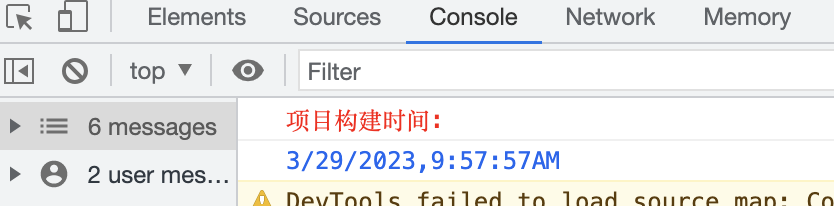

# vite-plugin-build-info-console

打印项目打包（构建）时间，可用来判断当前项目访问是否已更新

使用案例
```js
vite.config.js
export default defineConfig({
  plugins: [
   //...
    vitePluginBuild({output:'dist'}), output//默认为dist，文件输出目录
   
  ]
})

```
[示例]